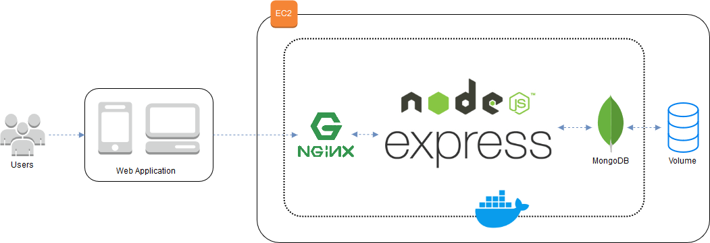
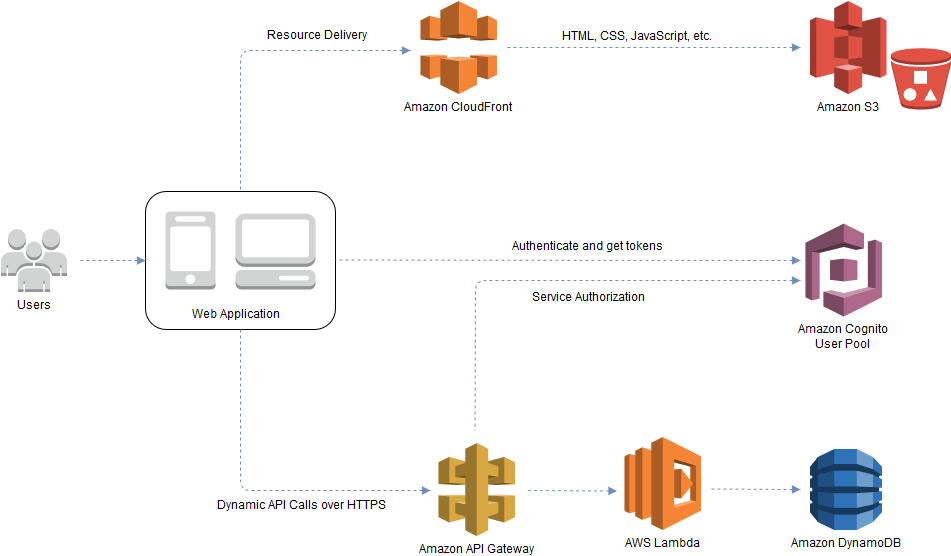

# **Project 4 GPS Track**

The app lets the user keep track of his location and then see the route he made.

### Access the app in: https://d3jajpkbjf11oj.cloudfront.net/

# 1. Team
### Camila White Romero - cwhiter@eafit.edu.co
### Ronald Cardona Martínez - rcardo11@eafit.edu.co
### Ricardo Rafael Azopardo Cadenas - rrazopardc@eafit.edu.co
### Alex Montoya Franco - amonto69@eafit.edu.co

# 2. Roles and Responsabilities

* Camila: Amazon Cognito - User Pool
* Ronald: Amazon API Gateway - AWS Lambda - Amazon DynamoDB
* Ricardo: Amazon API Gateway - AWS Lambda - Amazon DynamoDB
* Alex: Amazon CloudFront - Amazon S3

# 3. [Github](https://github.com/ronaldKM98/project4gps) ** Private **

# 4. Non-Functional Requirements

## 4.1. Availability

## 4.2. Performance

## 4.3. Security

# 5. Redesign of Project 1
Aspects improved from the original project

## Project 1 Overview

 

## Project 4 Overview

 

# 2. Analysis and Design

## 2.1. Functional Requirements
- The app must let the user Sign Up or Login.
- The app must let the user thack his location.
- The app must show with a route all the places he visited.

## 2.2. Non-Functional Requirements
- The app must have all data private per user and device.
- The app must not allow the user to check the route before login in.

## 2.3. Data Model

