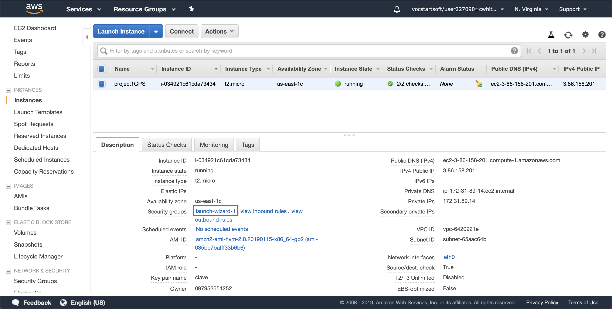
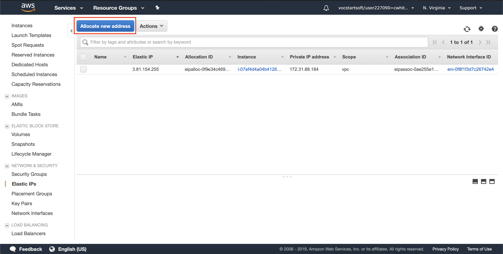

# **Project 1 GPS Track**

### By Camila White Romero - cwhiter@eafit.edu.co

# 1. Description

The app lets the user keep track of his location and then see the route he made. 
The style is based in one of [FaztWeb](https://faztweb.com) tutorials.

# 2. Analysis and Design

## 2.1. Functional Requirements
- The app must let the user Sign Up or Login.
- The app must let the user thack his location.
- The app must show with a route all the places he visited.

## 2.2. Non-Functional Requirements
- The app must have all data private per user and device.
- The app must not allow the user to check the route before login in.

## 2.3. Data Model
The user is registered with
```
firstName: { 
    type: String, 
    required: true 
  },
  lastName: { 
    type: String, 
    required: true 
  },
  email: { 
    type: String, 
    required: true 
  },
  password: { 
    type: String, 
    required: true 
  },
  date: { 
    type: Date, 
    default: Date.now 
  }
```
The Route is registered with
```
userId: {
  type: String,
  index: true
},
name: {
  type: String
},
date: {
  type: Date,
  required: true,
  default: Date.now
}
    
```
And each location the app tracks is registered with
```
routeId: {
  type: String,
  index: true,
},
lat: {
  type: Number,
  index: true
},
lon: {
  type: Number,
  index: true
},
userId: {
  type: String,
  index: true
},
date: {
  type: Date,
  required: true,
  default: Date.now
}
```
# 3. Development

All the following commands are for Mac.

## 3.1. Installing NodeJS and MongoDB
```
brew update
brew install node
brew install mongodb
```
To verify is MongoDB was installed, run
```
mongo
```

## 3.2. Create app
The first step to creating the app, run

```
npm init -y
```

This command creates the **package.json**.

## 3.3. Installing all dependencies
After having the **package.json** file, run
```
npm install bcryptjs connect-flash express express-handlebars express-session method-override mongoose passport passport-local socket.io --save
```

## 3.4. Docker
Download the [Docker graphic installer](https://docs.docker.com/docker-for-mac/install/)

Create the [Dockerfile](Dockerfile), [docker-compose](docker-compose.yml) and [NGINX configuration](nginx.conf)

## 3.5. Deploy in DCA

Clone the repository
```
git clone https://github.com/cwhite98/project1GPS.git
cd project1GPS
```
And then deploy the app with Docker
First create the Docker container
```
docker-compose build
```
Second run de docker container
```
docker-compose up
```
To run the container **detach**
```
docker-compose up -d
```
Check if the app was deployed
```
http://ipserver_or_domain
```
The domain for this app is: https://cwhiter.dis.eafit.edu.co

## 3.6. Deploy in AWS
- Create an accout in [AWS Educate](https://www.awseducate.com)
- Launch Virtual Machine with EC2


- Select Launch Instance


- Choose Amazon Linux 2 64-bit(x86)


- Select the Free tier and then press Review and Launch.


- Press Launch again.

- Select create a new pair key, give it a name, then Download it and finaly Launch Instance. 


- Select the instance.


- Add the ports 80 and 443.




- Then, configure the IP Address as static. 
    - Select the instance and then in the left menu select “Network & Security -> Elastic IPs”.
    
    
    - Press the Allocate New Address, select Amazon pool and then press allocate.
    
    
    
    - After having the IP Address, press close.
    - Then, select the instance, Actions, and then Associate Address.
    
    
    
After having the Virtual Machine configured, proceed to connect via ssh.

```
cd .ssh/
```
Move the key to the directory **.ssh** and give permissions.

```
mv ../Downloads/project1.pem .
chmod 400 project1.pem
```

Then connect via ssh.
```
ssh -i "project1.pem" ec2-user@ec2-3-81-154-255.compute-1.amazonaws.com
```


Install **Docker** .

```
sudo yum update -y
sudo amazon-linux-extras install docker
service docker start
sudo usermod -a -G docker ec2-user
```
Exit **ssh** and connect again.

```
ssh -i "project1.pem" ec2-user@ec2-3-92-193-165.compute-1.amazonaws.com
docker info
```

To install **docker-compose** follor the next commands.

```
sudo curl -L https://github.com/docker/compose/releases/download/1.22.0/docker-compose-$(uname -s)-$(uname -m) -o /usr/local/bin/docker-compose
sudo chmod +x /usr/local/bin/docker-compose
docker-compose version
```

After having Docker installed, clone the repository

```
mkdir apps
cd apps
git clone https://github.com/cwhite98/project1GPS.git
cd project1GPS
```

Deploy the app with Docker

```
docker-compose build
docker-compose up -d
```

Access the app via: https://ec2-3-81-154-255.compute-1.amazonaws.com

After checking that the previous link works, proceed with getting a domain in [dot.tk](http://www.dot.tk/en/index.html?lang=en) and asign the static IP Address to the domain.

Access the app in: https://project1gps.tk
